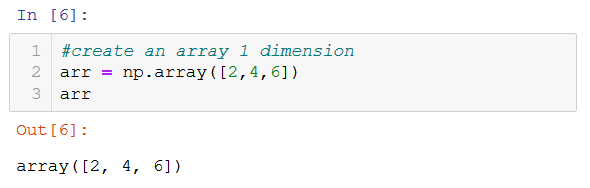

# NumPy Library
[Official website](https://numpy.org/)

* NumPy is the most basic yet a powerful package for scientific computing and data manipulation in Python. 
* It helps as to do the mathematical and scientific operation and used extensively in data science. 

## Basic elements
### Unidimensional arrays (Lists)
 
 
 
### Bidimensional arrays (Matrixs)
 
 

## Notes
[Jupyter visualization](./NumPy_codes.html)
 
[Download Jupyter notebook](./NumPy_codes.ipynb)

## Links of interest
[Official quickstart tutorial](https://numpy.org/devdocs/user/quickstart.html)
