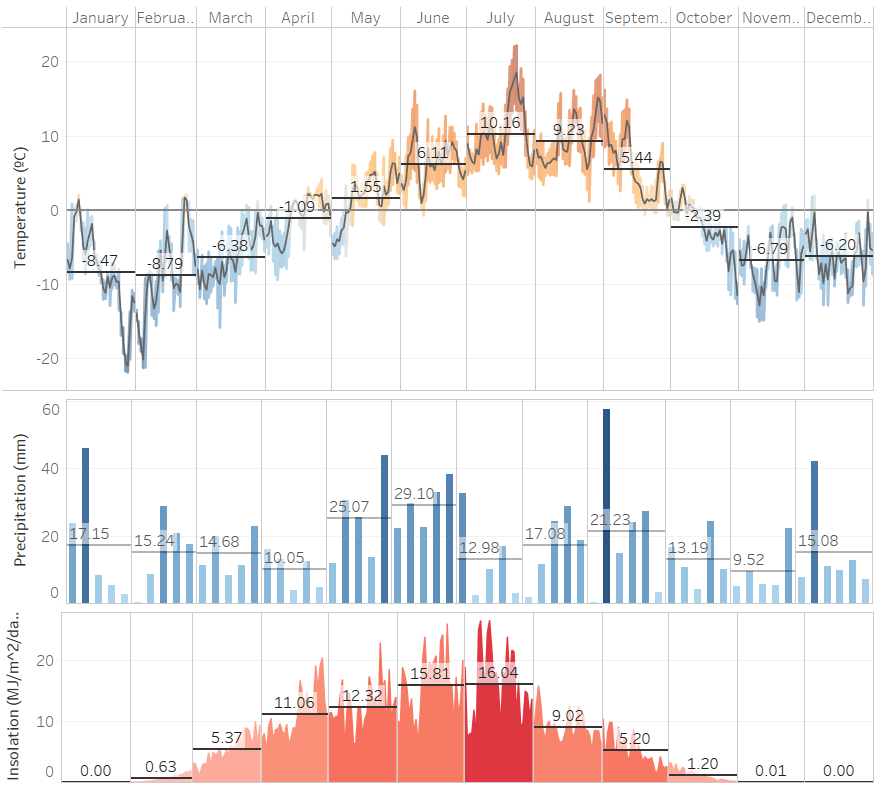

# Challenge #1:  Cultivar a 70º de latitud 

## Introducción
La cuarentena ha traido muchas situaciones antes inimaginables, como pasar semanas enteras encerrados en casa sin ver a nadie más que a nuestros convivientes. Como resultado, han resurgido antiguos pasatiempos o actividades para la que no encontrábamos ningún momento.
  
Mi inquietud por llevar un jardín y ver crecer las plantas desde pequeñas semillas lleva mucho tiempo en mi cabeza, pero las sucesivas mudanzas de los últimos años lo han aplazado. 
 
Finalmente, tengo el tiempo para montar una pequeña huerta, pero las condiciones climáticas no parecen ser las más favorables. Intentaré llevar un registro de la evolución del experimento.

## El sitio
La cuarentena me ha pillado lejos de casa, al norte de Noruega. Aquí los inviernos son noches que duran varios meses, en oposición a los veranos sin ocasos.

Datos de temperatura, precipitaciones y radiación en 2019.
[Link](https://public.tableau.com/views/WeatherFinnmark/Dashboard1?:display_count=y&:origin=viz_share_link)

## Links of interest
[Python Official website](https://www.python.org/)
 
[Anaconda Official website](https://www.anaconda.com/)
 
[Jupyter Official website](https://jupyter.org/)