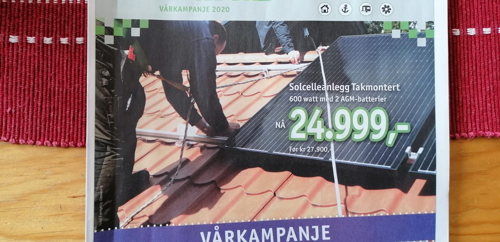

# Photovoltaic panels in Norway

## Available notes
* [Jupyter visualization](./PV_Norway.html)
 
* [Download Jupyter notebook](./PV_Norway.ipynb)
  

## Information
A product catalog (23.03.20 - 27.04.20) of Norwegian distribution was advertising solar panels in its cover. 
* Does it make sense investing in solar systems in this context?
* How much would it cost to install the system? How much energy will produce along the year? How much money could be saved in energy-billing?
* At a latitud of 70 degrees (Finnmark) there are long periods of daylight/night during the year. How will be the numbers with batteries, feed-in-tariff, net-billing, net-metering? (Size of the systems, energy generated, payback period)  

## Links of interest
[SQLAlchemy](https://www.sqlalchemy.org/)
 
[SQLite](https://www.sqlite.org/index.html)