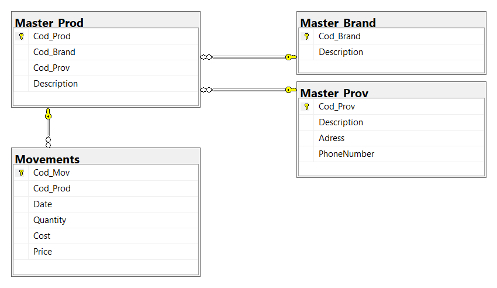

# SQL

## Available notes
__Basic example: alfajores.db__  

* [Jupyter visualization](./SQL_example.html) (Version 27.04.20)
 
* [Download Jupyter notebook](./SQL_example.ipynb) (Version 27.04.20)
  
Observations  
The example runs in Jupyter using the library sqlalchemy.  
If it is executed in a SQL environment, the first steps can be skiped and there is no need of '%%sql' in every cell. 
Every jupyter cell represents a query in SQL.
  

## Information
SQL (Structured Query Language) is a standardized programming language that's used to manage relational databases and perform various operations on the data in them.

## Basic elements

### Relational database
A database is a set of data stored in a computer. This data is usually structured in a way that makes the data easily accessible.  
A relational database is a type of database. It uses a structure that allows us to identify and access data in relation to another piece of data in the database.

 
### Table
A relational database system contains one or more objects called tables. The data or information for the database are stored in these tables.  
Tables are uniquely identified by their names and are comprised of columns and rows. Columns contain the column name, data type, and any other attributes for the column. Rows contain the records or data for the columns. 

### Query
SQL, abbreviation for Structured Query Language,  is a standardized query language for requesting information from a database. In fact, outside of computing terminology, the words "query" and "question" can be used interchangeably.

## Links of interest
[SQLAlchemy](https://www.sqlalchemy.org/)
 
[SQLite](https://www.sqlite.org/index.html)

