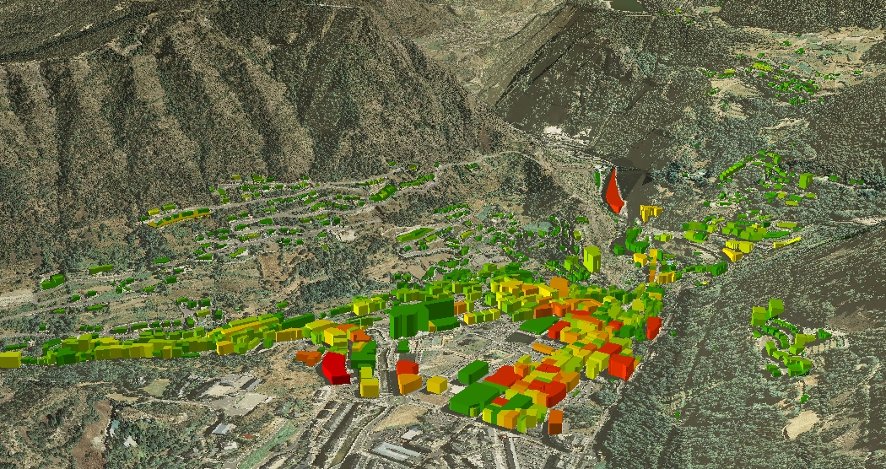

# Urban Building Energy Model (UBEM)

## Available notes
[Paper presented in USIM2018](./uSIM_paper.pdf)
 
[Master's thesis (Spanish)](./TESIS_GUILLAUMET.pdf)
   

## Information
The climate change is a problem produced by collective action on a global scale, since the emissions accumulate over time and combine globally. In the last decades, climate variation has caused impacts all over the world in both natural and human systems, what shows system’s sensitivity to its effects. To cope with this situation, cooperative and generalized responses are required to mitigate the causes and deal with the consequences. The action’s efficiency can be improved by complementary measures in the different areas and levels.
 
There is an undeniable relation between the reduction of emissions and the energy system reform, as vast majority of the anthropogenic emissions is the result of fossil fuels burning. It is considered essential for future development to establish new guidelines linked to the use of energy, rethinking its chain of production, distribution and consumption, in order to analyze the impact reduction
possibilities in each of the stages. The evolution to more sustainable alternatives that don’t compromise the resources and the natural environment, it has become one of the main concerns of the current energy problem.
 
In this scenario, local governments and public utility companies are increasingly focusing on strategies for energy efficiency in buildings, as a key component in emission reduction plans and energy supply strategies. Different experiences are being developed to support energy planning in urban scale, involving the application of methodologies that process existing urban information and build models
that can be used in decision-making.
 
This document presents an experience on a case study in Andorra that proposes a work flow for data collection, treatment and the construction of archetypes. The aim is to build the foundations for Urban Building Energy Models (UBEM) that contribute to explain the behavior of energy consumption and to predict future reactions. Being the main purpose of the research to define work criteria and identify barriers and opportunities, special attention will be paid to these activities in order to improve the methodology and make it applicable for other urban centers.
  

KEY WORDS: Climate Change, Urban modeling, Energy planning, Hierarchical Cluster, Building
archetypes, Geospatial data

 
## Links of interest
[Official website](https://numpy.org/)
 
[Official quickstart tutorial](https://numpy.org/devdocs/user/quickstart.html)