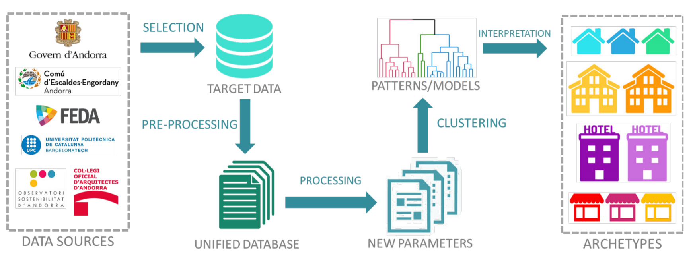

# Urban Building Energy Model (UBEM)

## Available notes
* [Results displayed in Carto](https://paugui.carto.com/builder/8c989326-6329-4bf4-92a4-d05776f2b054/embed)
 
* [Paper presented in USIM2018](./uSIM_paper.pdf)
 
* [Master's thesis (Spanish)](https://upcommons.upc.edu/handle/2117/123084)
  

## Information
**There is an undeniable relation between the reduction of emissions and the energy system reform**, as vast majority of the anthropogenic emissions is the result of fossil fuels burning. It is considered essential for future development to establish new guidelines linked to the use of energy, rethinking its chain of production, distribution and consumption, in order to analyze the possibility of impact reduction in each of the stages. The evolution to more sustainable alternatives that don’t compromise the resources and the natural environment, it has become the main concerns of the current energy problem.
  
In this scenario, **local governments and public utility companies are increasingly focusing on strategies for energy efficiency** in buildings, as a key component in emission reduction plans and energy supply strategies. Different experiences are being developed to support energy planning in urban scale, involving the application of methodologies that process existing urban information and build models
that can be used in decision-making.
  
The aim of this wirk was to build the foundations for **Urban Building Energy Models (UBEM)** to explain the behavior of energy consumption and to predict future reactions. Being the main purpose of the research to define work criteria and identify barriers and opportunities, special attention will be paid to these activities in order to improve the methodology and make it applicable for other urban centers.
  

<iframe width="100%" height="520" frameborder="0" src="https://paugui.carto.com/builder/8c989326-6329-4bf4-92a4-d05776f2b054/embed" allowfullscreen webkitallowfullscreen mozallowfullscreen oallowfullscreen msallowfullscreen></iframe>
 

#### Key words: 
Climate Change, Urban modeling, Energy planning, Hierarchical Cluster, Building archetypes, Geospatial data
  
## Links of interest
[uSIM 2018 Proceedings](http://www.ibpsa.org/usim-2018-proceedings/)
 
[CARTO official page](https://carto.com/)