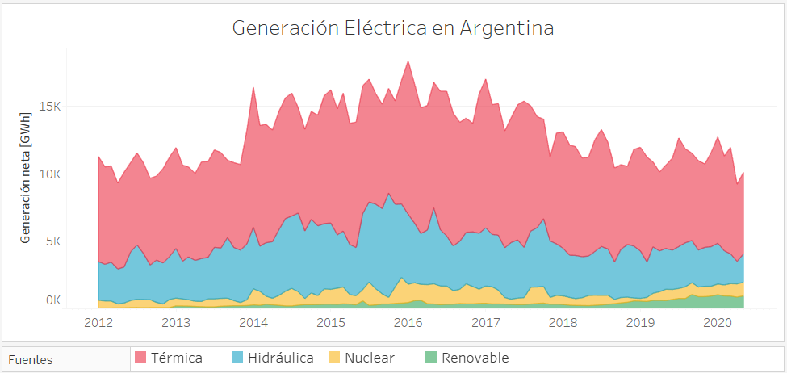

# Datos operativos eléctricos de Argentina

## Descripción de los datos
La Compañía Administradora del Mercado Mayorista Eléctrico (CAMMESA) pone amablemente a nuestra disposición en su página oficial datos operativos del Sistema Argentino de Interconexión (SADI).   
Los informes mensuales contienen datos detallados de demanda, generación, potencia instalada, consumo de combustible combustibles y precios.

Disponible desde el 10.2015 hasta el 09.2020, con posibles actualizaciones mensuales.

## Códigos disponibles

### Descargar informes mensuales

* [Visualización en Jupyter](./files/Descargardatos.html) (Version 18.07.20)
 
* [Descargar Jupyter notebook](./files/Descargardatos.ipynb) (Version 18.07.20)
 

### Extraer datos de Excel

#### Potencia instalada
Resumen mensual que incluye detalles de potencia instalada (MW), por central, agente, región, tipo de máquina, fuente de generación y tecnología.

* [Visualización en Jupyter](./files/ExtraerPotencia.html) (Version 19.07.20)
 
* [Descargar Jupyter notebook](./files/ExtraerPotencia.ipynb) (Version 19.07.20)
  
* [Descargar de datos de generación](./files/PotenciaInstalada.csv) (ejemplo)  
Datos correspondientes a todo el país (01.2016 - 05.2016). 
Formato del archivo: CSV | Tamaño del archivo: 0.03MB

#### Generación
Resumen mensual que incluye detalles de generación (MWh) por máquina, central, agente, región, tipo de máquina, tipo de fuente, tecnología y generación neta mensual.

* [Visualización en Jupyter](./files/ExtraerGeneracion.html) (Version 19.07.20)
 
* [Descargar Jupyter notebook](./files/ExtraerGeneracion.ipynb) (Version 19.07.20)
  
* [Descargar de datos de generación](./files/Generacion.csv) (ejemplo)  
Datos correspondientes a todo el país (01.2016 - 05.2016). 
Formato del archivo: CSV | Tamaño del archivo: 4.6MB

#### Consumo de combustibles para generación eléctrica
Resumen mensual que incluye detalles de consumo de combustibles para generación eléctrica, por central, máquina, agente, tipo de máquina, fuente de generación, tecnología, y tipo de combustible.   
Unidades: Gas natural [Dam3], Fuel oil [Ton],  Gas oil [M3], Carbón mineral [Ton], Biodiesel [Ton]

* [Visualización en Jupyter](./files/ExtraerCombustibles.html) (Version 18.07.20)
 
* [Descargar Jupyter notebook](./files/ExtraerCombustibles.ipynb) (Version 18.07.20)
  
* [Descargar de datos de generación](./files/Combustibles.csv) (ejemplo)  
Datos correspondientes a todo el país (01.2016 - 05.2016). 
Formato del archivo: CSV | Tamaño del archivo: 2.6 MB

#### Demanda
Resumen mensual que incluye detalles de demanda (MWh) de grandes usuarios y distribuidoras, por región, provincia, tarifa y categoría.

* [Visualización en Jupyter](./files/ExtraerDemanda.html) (Version 18.07.20)
 
* [Descargar Jupyter notebook](./files/ExtraerDemanda.ipynb) (Version 18.07.20)
  
* [Descargar de datos de generación](./files/Demanda.csv) (ejemplo)  
Datos correspondientes a todo el país (01.2016 - 05.2016). 
Formato del archivo: CSV | Tamaño del archivo: 8.5 MB

#### Balance
Resumen anual del balance (MWh) entre oferta y demanda,  por tipo de fuente.

* [Visualización en Jupyter](./files/ExtraerBalance.html) (Version 18.07.20)
 
* [Descargar Jupyter notebook](./files/ExtraerBalance.ipynb) (Version 18.07.20)
  
* [Descargar de datos de generación](./files/Balance.csv) (ejemplo)  
Datos correspondientes a todo el país (01.2016 - 05.2016). 
Formato del archivo: CSV | Tamaño del archivo: 0.02 MB

## Links de interés
[CAMMESA](https://portalweb.cammesa.com/memnet1/Pages/descargas.aspx)