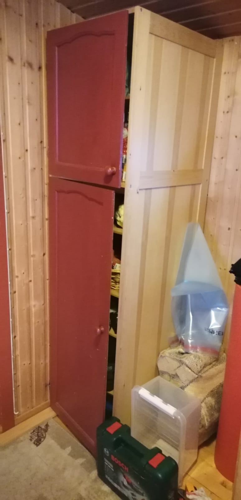
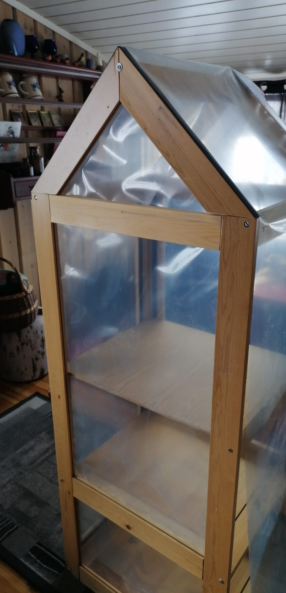
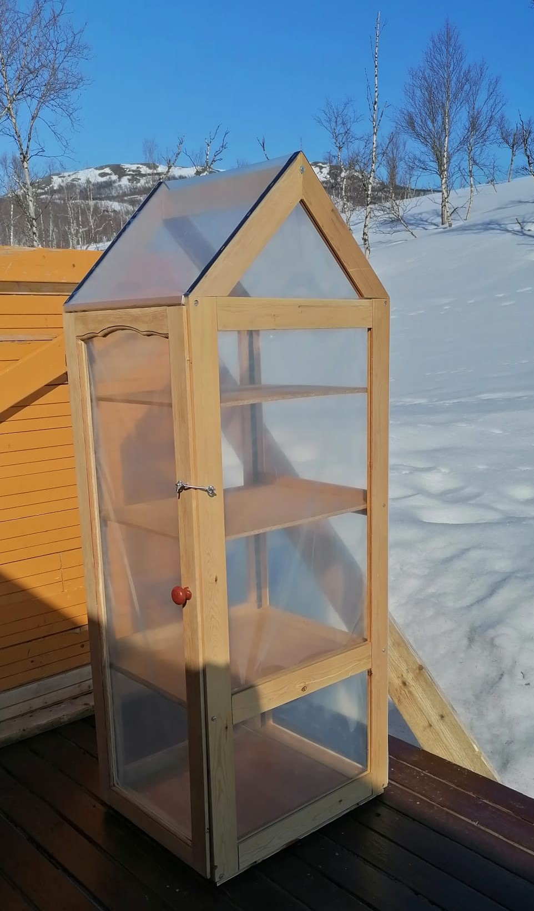
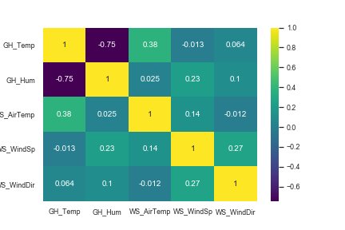

# Challenge #1:  Cultivar a 70º de latitud 

## Introducción
La cuarentena ha traido muchas situaciones antes inimaginables, como pasar semanas enteras encerrados en casa sin ver a nadie más que a nuestros convivientes. Como resultado, han resurgido antiguos pasatiempos o actividades para la que no encontrábamos ningún momento.
  
Finalmente, tengo el tiempo para montar una pequeña huerta, pero las condiciones climáticas no parecen ser las más favorables. Intentaré llevar un registro de la evolución del experimento.

## El sitio
La cuarentena me ha pillado lejos de casa, al norte de Noruega. Aquí los inviernos son noches que duran varios meses, en oposición a los veranos sin ocasos.  
Como puede observarse en la siguiente figura, las medias de temperatura comienzan a ser positivas a partir del mes de mayo, y se mantienen hasta el mes de septiembre. Una situación similar se observa en la radiación diaria incidente, con valores nulos durante los meses de invierno y un incremento considerable en los meses de verano.

Datos de temperatura, precipitaciones y radiación en 2019.
[Link](https://public.tableau.com/views/WeatherFinnmark/Dashboard1?:display_count=y&:origin=viz_share_link)

Las características climáticas suponen un desafío al momento de cultivar plantas, muy pocas especies sobrevivirán los meses de oscuridad y las nevadas, por lo que el tiempo es limitado. De igual forma, los meses de verano resultan aún fríos si se tiene en cuenta que aún en mayo y septiembre se registran mínimas bajo cero.

## Primer experimento: invernadero
A partir de un mueble viejo que entró en desuso (y cuyo destino era la hoguera), se diseñó un invernadero con estructura de madera y recubierto de plástico en todas sus caras.  

El objetivo del mismo es atenuar los cambios de temperatura, y proteger las plantas de la incidencia del viento.

  
   

El invernadero fue instalado en orientación Este, con sol desde la mañana hasta alrededor de las 4 de la tarde. El norte y el Oeste están protegidos del viento a través de una construcción existente y una mampara, y atornillado a una terraza existente de madera.

### Especias y hortalizas
* Cilantro (Coriandrum sativum) [Ficha](https://www.nelsongarden.no/nor/nok/p/krydder_130/koriander_85393)
* Albahaca (Ocimum basilicum) [Ficha](https://www.nelsongarden.no/nor/nok/p/krydder_130/basilikum_90099)
* Perejil (Petroselinum crispum) [Ficha](https://www.nelsongarden.no/nor/nok/p/krydder_130/persille_90948)
* Ciboulette (Allium schoenoprasum) [Ficha](https://www.nelsongarden.no/nor/nok/p/krydder_130/graslk_90317)
* Lechuga (Lactuca sativa)[Ficha](https://www.nelsongarden.no/nor/nok/p/grnnsaker_120/salat-hode-_85991)
* Rúcula (Eruca vesicaria)[Ficha](https://www.nelsongarden.no/nor/nok/p/grnnsaker_120/ruccola_91353)

### Flores

* Caléndula (Calendula officinalis)[Ficha](https://www.nelsongarden.no/nor/nok/p/blomster_140/ringblomst_88157)
* Guisante de olor (Lathyrus odoratus) [Ficha](https://www.nelsongarden.no/nor/nok/p/blomster_140/blomsterert_94090)
* Aciano (Centaurea cyanus) [Ficha](https://www.nelsongarden.no/nor/nok/p/blomster_140/kornblomst_87297)
* Alelí (Matthiola incana) [Ficha](https://www.nelsongarden.no/nor/nok/p/blomster_140/levky-sommer--ten-week-bl-farger_87827)
* Violetas (Hesperis matronalis) [Ficha](https://www.nelsongarden.no/nor/nok/p/blomster_140/dagfiol_94228)

## Monitoreo de temperaturas
Se registraron la temperatura y humedad relativa dentro del invernadero a partir de una estación meteorológica hogareña. El resporte de estos datos se relacionaron con la estación meteorológica nacional más cercana, para ver la relación entre las condiciones exteriores e interiores.
A pesar que lo ideal para construir modelos predictivos de temperatura sería contar con datos como cobertura de nubes y radiación, la estación nacional sólo registra temperatura, precipitaciones y viento.

Se realizó una mapa de calor que relaciona las variables a las que se tenía acceso en ambas estaciones. Los mapas de calor sirven para visualizar datos a través de las variaciones de color. Los mapas de calor son buenos para mostrar la diferencia a través de múltiples variables, revelando cualquier patrón, que pone en evidencia si las variables son similares entre sí, y para detectar si existe cualquier correlación entre ellas.

GH: estación meteorológica dentro del invernadero.  
WS: estación meteorológica nacional.

1. Se observa una relación inversa entre la humedad relativa y la temperatura, indicada por la cercanía al -1.
2. Existe una relación no muy significativa entre la temperatura del invernadero y la temperatura del aire (probablemente porque depende también de otros factores no computados), indicada por un valor positivo medio.
3. Existe una relación no muy significativa entre la dirección del viento y su velocidad, pero no con las variables de temperatura, indicada por un valor positivo medio.

## Links de interés
[Datos climáticos](https://power.larc.nasa.gov/)
 
[Compost invernal](https://empressofdirt.net/easy-winter-composting/)
