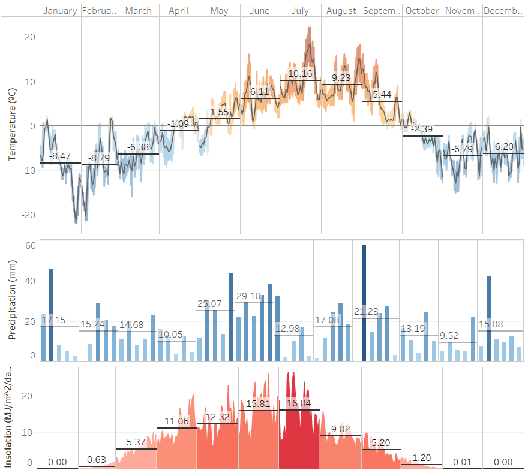
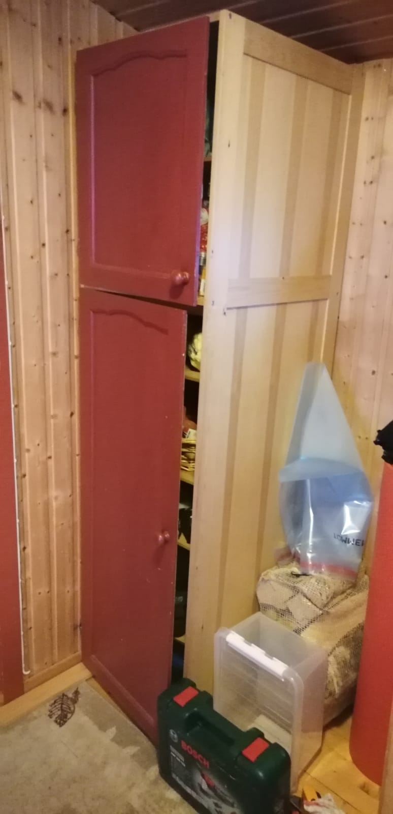
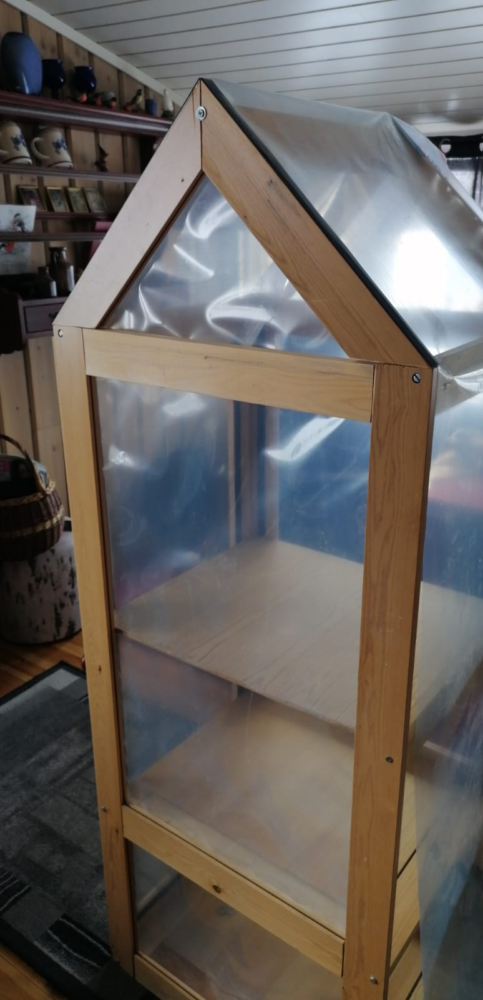

# Challenge #1:  Cultivar a 70º de latitud 

## Introducción
La cuarentena ha traido muchas situaciones antes inimaginables, como pasar semanas enteras encerrados en casa sin ver a nadie más que a nuestros convivientes. Como resultado, han resurgido antiguos pasatiempos o actividades para la que no encontrábamos ningún momento.
  
Mi inquietud por llevar un jardín y ver crecer las plantas desde pequeñas semillas lleva mucho tiempo en mi cabeza, pero las sucesivas mudanzas de los últimos años lo han aplazado. 
 
Finalmente, tengo el tiempo para montar una pequeña huerta, pero las condiciones climáticas no parecen ser las más favorables. Intentaré llevar un registro de la evolución del experimento.

## El sitio
La cuarentena me ha pillado lejos de casa, al norte de Noruega. Aquí los inviernos son noches que duran varios meses, en oposición a los veranos sin ocasos.  
Como puede observarse en la siguiente figura, las medias de temperatura comienzan a ser positivas a partir del mes de mayo, y se mantienen hasta el mes de septiembre. Una situación similar se observa en la radiación diaria incidente, con valores nulos durante los meses de invierno y un incremento considerable en los meses de verano.

Datos de temperatura, precipitaciones y radiación en 2019.
[Link](https://public.tableau.com/views/WeatherFinnmark/Dashboard1?:display_count=y&:origin=viz_share_link)

Las características climáticas suponen un desafío al momento de cultivar plantas, ya que muy pocas especies sobrevivirán los meses de oscuridad y las nevadas. Asimismo, los meses de verano resultan aún fríos si se tiene en cuenta que aún en mayo y septiembre se registran mínimas bajo cero.

## Primer experimento: invernadero
A partir de un mueble viejo que entró en desuso (y cuyo destino era la hoguera), se diseñó un invernadero con estructura de madera y recubierto de plástico en todas sus caras.  

El objetivo del mismo es atenuar los cambios de temperatura, y proteger las plantas de la incidencia climática de las lluvias y el viento.

  
   

### Especias y hortalizas
* Cilantro [Ficha](https://www.nelsongarden.no/nor/nok/p/krydder_130/koriander_85393)
* Albahaca [Ficha](https://www.nelsongarden.no/nor/nok/p/krydder_130/basilikum_90099)
* Ciboullete [Ficha](https://www.nelsongarden.no/nor/nok/p/krydder_130/graslk_90317)
* Rúcula [Ficha](https://www.nelsongarden.no/nor/nok/p/grnnsaker_120/ruccola_91353)
* Lechuga [Ficha](https://www.nelsongarden.no/nor/nok/p/grnnsaker_120/salat-hode-_85991)
* Perejil [Ficha](https://www.nelsongarden.no/nor/nok/p/krydder_130/persille_90948)

### Flores

* Caléndula [Ficha](https://www.nelsongarden.no/nor/nok/p/blomster_140/ringblomst_88157)
* Guisante de olor (Lathyrus odoratus) [Ficha](https://www.nelsongarden.no/nor/nok/p/blomster_140/blomsterert_94090)
* Aciano (Centaurea cyanus) [Ficha](https://www.nelsongarden.no/nor/nok/p/blomster_140/kornblomst_87297)
* Alelí (Matthiola incana) [Ficha](https://www.nelsongarden.no/nor/nok/p/blomster_140/levky-sommer--ten-week-bl-farger_87827)
* Violetas (Hesperis matronalis) [Ficha](https://www.nelsongarden.no/nor/nok/p/blomster_140/dagfiol_94228)

## Links de interés
[Datos climáticos](https://power.larc.nasa.gov/)
 
