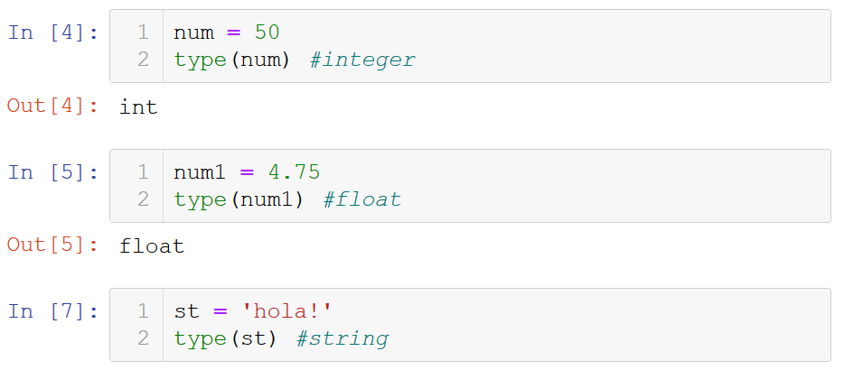

# Basic Python

## Available notes

* [Jupyter visualization](./Python_codes.html)
 
* [Download Jupyter notebook](./Python_codes.ipynb)
   

## Information
The notes include data types, indexing, basic methods and functions.
   

## Links of interest
[Python Official website](https://www.python.org/)
 
[Anaconda Official website](https://www.anaconda.com/)
 
[Jupyter Official website](https://jupyter.org/)