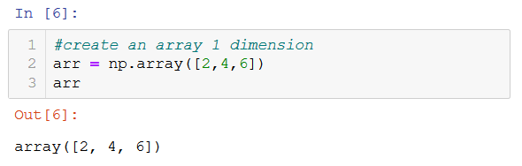

# Library: NumPy

## Notes
[Jupyter visualization](./NumPy_codes.html)
 
[Download Jupyter notebook](./NumPy_codes.ipynb)
   
## Information
* NumPy is the most basic yet a powerful package for scientific computing and data manipulation in Python.
 
* It helps as to do the mathematical and scientific operation and used extensively in data science. 

## Basic elements
A homogeneous container of numerical element of a single type.
### Unidimensional arrays
Arrays can have 1 dimension (similar to python lists).
 
 
### Bidimensional arrays
 Arrays can have 2 dimensions (similar to python matrix).
 

## Links of interest
[Official website](https://numpy.org/)
 
[Official quickstart tutorial](https://numpy.org/devdocs/user/quickstart.html)
