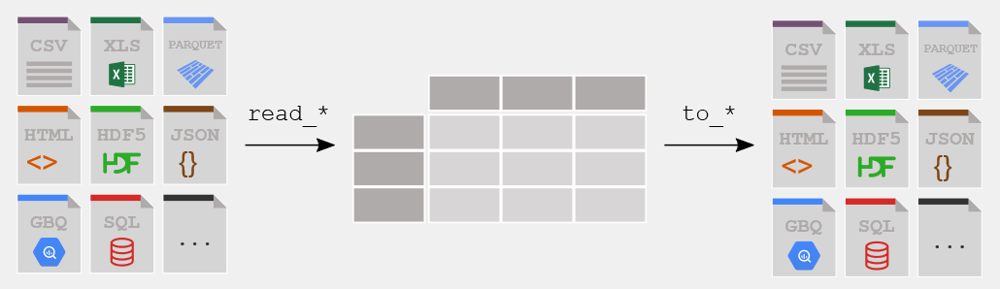
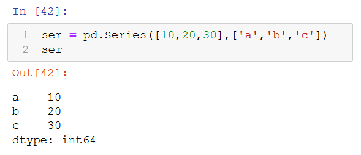
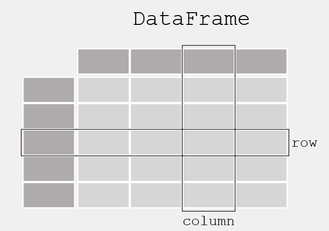

# Library: Pandas

## Available notes
* [Jupyter visualization](./Pandas_codes.html)
 
* [Download Jupyter notebook](./Pandas_codes.ipynb)
   
## Information
* Pandas is an open-source library built on top of numpy providing high-performance, easy-to-use data structures and data analysis tools for the Python programming language.
* Pandas supports the integration with many file formats or data sources out of the box (csv, excel, sql, json, parquet,…).

 

## Basic elements
A homogeneous container of numerical element of a single type.
### Series
One-dimensional ndarray with axis labels.

 
### Data Frames
Two-dimensional, size-mutable, potentially heterogeneous tabular data, also contains labeled axes (rows and columns). 

 

## Links of interest
[Pandas Official website](https://pandas.pydata.org)
 