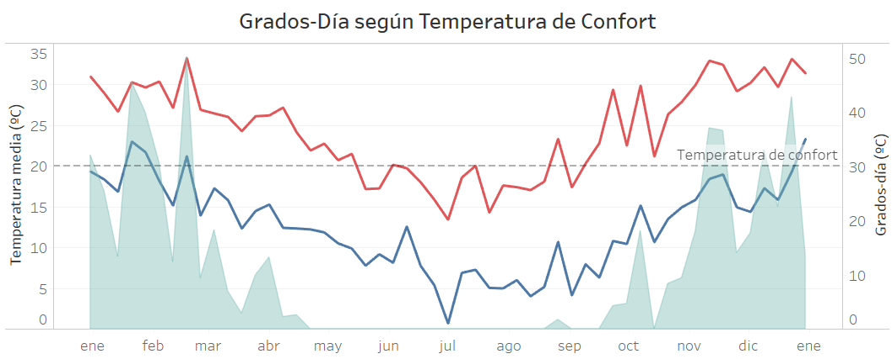

# Data visualization
Data visualization is the graphical representation of information and data.  
By using visual elements like charts, graphs, and maps, data visualization tools provide an accessible way to see and understand trends, outliers, and patterns in data.  
In the world of Big Data, data visualization tools and technologies are essential to analyze massive amounts of information and make data-driven decisions.

## Available notes

* [Confort temperature & Day-Degrees](./GD/mainGD.md)    
